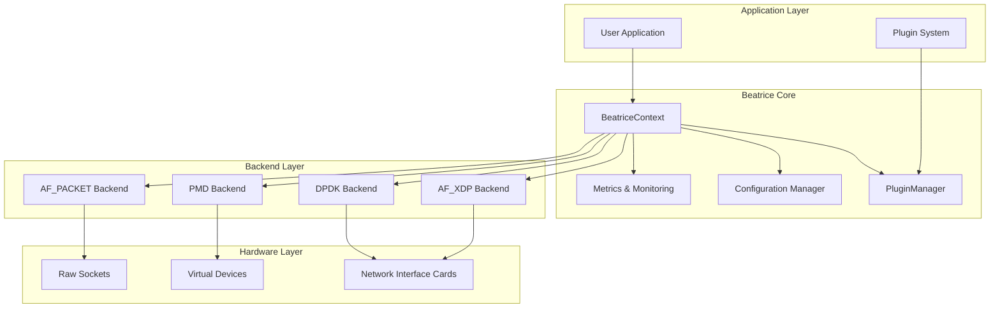
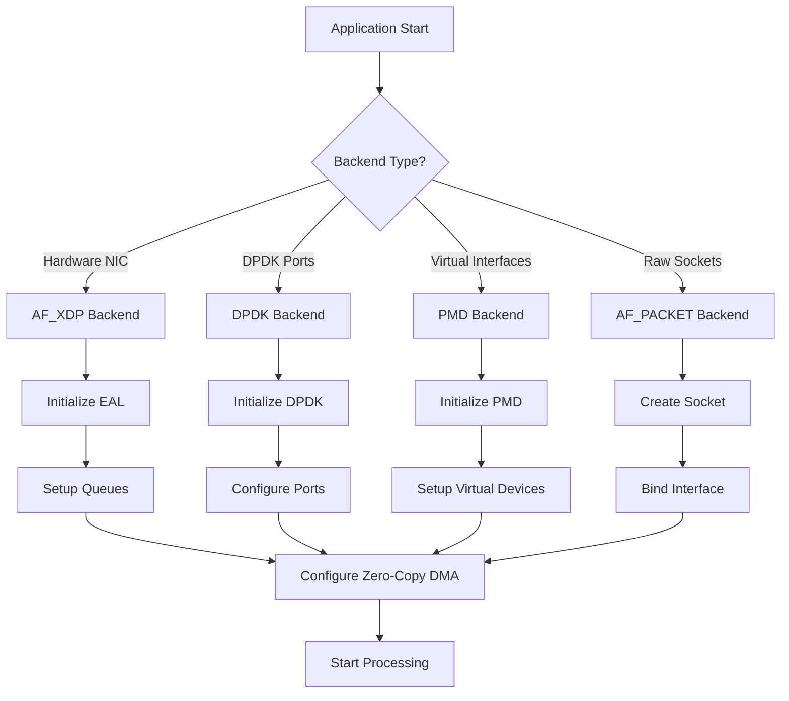
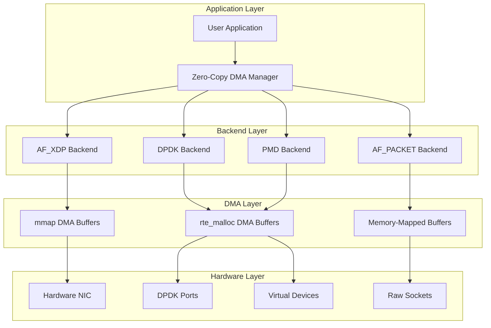
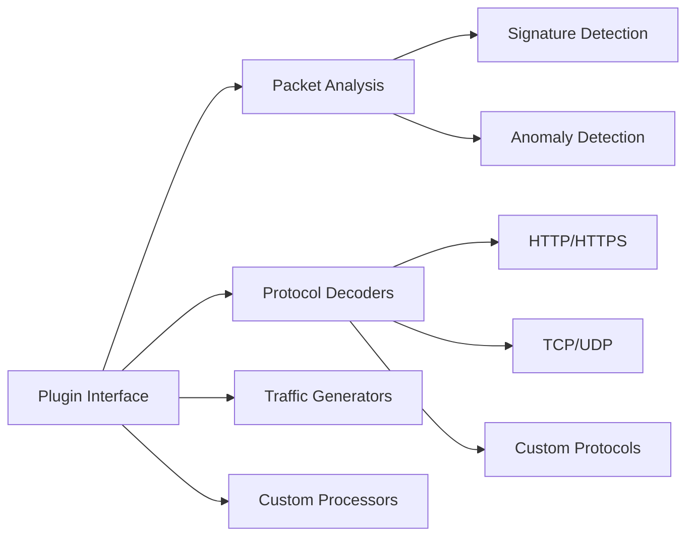
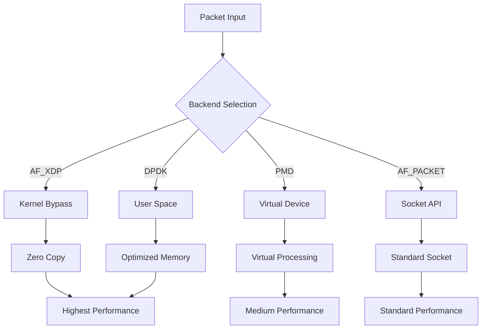

# Beatrice - Network Packet Processing SDK

[](LICENSE)
[](https://isocpp.org/)
[](https://cmake.org/)
[](https://github.com/your-org/beatrice)

> **High-performance, modular network packet processing SDK with multi-backend support**

## Table of Contents

- [Overview](#overview)
- [Architecture](#architecture)
- [Features](#features)
- [Backends](#backends)
- [Installation](#installation)
- [Quick Start](#quick-start)
- [API Reference](#api-reference)
- [Performance](#performance)
- [Development](#development)
- [Contributing](#contributing)
- [License](#license)

## Overview

Beatrice is a network packet processing SDK designed for high-performance network analysis, monitoring, and processing applications. Built with modern C++20, it provides a unified interface across multiple capture backends while maintaining exceptional performance and reliability.

### Key Benefits

- **Multi-Backend Architecture**: Support for AF_XDP, DPDK, PMD, and AF_PACKET backends
- **High Performance**: Optimized for low-latency, high-throughput packet processing
- **Production Ready**: Comprehensive error handling and reliability features
- **Modular Design**: Plugin-based architecture for extensibility
- **Cross-Platform**: Linux and macOS support with consistent APIs
- **Command Line Interface**: Powerful CLI for easy testing and development
- **Zero-Copy DMA Access**: Advanced memory management for maximum performance

## Architecture

### System Architecture Diagram



### Backend Selection Flow



### Zero-Copy DMA Access Architecture



## Features

### Core Capabilities

- **Multi-Backend Support**
  - AF_XDP: High-performance hardware NIC processing
  - DPDK: Optimized data plane development
  - PMD: Virtual network interface management
  - AF_PACKET: Raw socket packet capture

- **Advanced Packet Processing**
  - Zero-copy operations where supported
  - DMA access for high-performance memory management
  - Batch processing for optimal throughput
  - Configurable buffer management
  - Real-time packet filtering

- **System Features**
  - Comprehensive error handling with Result types
  - Structured logging with multiple levels
  - Performance metrics and monitoring
  - Health checking and diagnostics
  - Graceful shutdown and resource management
  - Zero-copy DMA access management
  - Runtime configuration of zero-copy and DMA features
  - DMA buffer allocation and management
  - Cross-backend DMA access consistency

- **Advanced Metrics & Telemetry**
  - Real-time performance monitoring
  - Distributed tracing and spans
  - Health status reporting
  - Custom event collection
  - Multiple export formats (Prometheus, JSON)
  - Performance measurement and analysis
  - Context-aware telemetry
  - Custom backend integration

### Plugin System



## Backends

### AF_XDP Backend

**Purpose**: High-performance hardware NIC processing using eBPF/XDP technology

**Features**:
- Zero-copy packet processing
- DMA access with mmap-based buffer allocation
- Kernel bypass for maximum performance
- Hardware offloading support
- Multi-queue processing

**Use Cases**:
- High-frequency trading networks
- DDoS protection systems
- Network monitoring at line rate
- Performance-critical applications

### DPDK Backend

**Purpose**: Optimized data plane development with DPDK framework

**Features**:
- Poll-mode driver support
- Zero-copy DMA access with rte_malloc
- NUMA-aware memory management
- Hardware timestamping
- Advanced queue management

**Use Cases**:
- Network function virtualization (NFV)
- Software-defined networking (SDN)
- High-performance routers
- Traffic analysis systems

### PMD Backend

**Purpose**: Virtual network interface management and testing

**Features**:
- Virtual device creation (TAP/TUN)
- Zero-copy DMA access with rte_malloc
- PMD type selection
- Virtual network simulation
- Testing and development support

**Use Cases**:
- Network testing environments
- Virtual machine networking
- Development and debugging
- Network simulation

### AF_PACKET Backend

**Purpose**: Raw socket packet capture using Linux socket API

**Features**:
- Promiscuous mode support
- Memory-mapped DMA buffers
- Configurable buffer sizes
- Blocking/non-blocking modes
- Cross-platform compatibility

**Use Cases**:
- Network monitoring tools
- Security applications
- Protocol analysis
- Educational purposes

## Installation

### Docker (Recommended)

The easiest way to get started with Beatrice is using Docker:

```bash
# Build and run with Docker
docker build -t beatrice:latest .
docker run --rm -it --privileged --network host beatrice:latest

# Or use Docker Compose
docker-compose up -d beatrice
```

For detailed Docker instructions, see [README-Docker.md](README-Docker.md).

### Manual Installation

#### Prerequisites

- **C++20 compatible compiler** (GCC 10+, Clang 12+)
- **CMake 3.16+**
- **Linux kernel 4.18+** (for AF_XDP support)
- **libbpf-dev** (for eBPF/XDP support)
- **DPDK 22.0+** (optional, for DPDK backend)

### CLI Installation

The Beatrice CLI (`beatrice_cli`) is automatically installed with the main package:

```bash
# Install from source (includes CLI)
sudo make install

# CLI is installed to /usr/local/bin/beatrice_cli
which beatrice_cli

# Test CLI installation
beatrice_cli --help
```

### System Requirements

| Component | Minimum | Recommended |
|-----------|---------|-------------|
| CPU | x86_64, ARM64 | x86_64 with AES-NI |
| RAM | 4GB | 16GB+ |
| Storage | 2GB | 10GB+ |
| Network | 1Gbps | 10Gbps+ |

### Installation Methods

#### Package Manager (Recommended)

**Fedora/RHEL/CentOS:**
```bash
# Install dependencies
sudo dnf install gcc-c++ cmake libpcap-devel libbpf-devel

# Install DPDK (optional, for DPDK backend)
sudo dnf install dpdk-devel dpdk-tools

# Build and install
mkdir build && cd build
cmake .. -DCMAKE_BUILD_TYPE=Release
make -j$(nproc)
sudo make install
```

**Ubuntu/Debian:**
```bash
# Install dependencies
sudo apt update
sudo apt install build-essential cmake libpcap-dev libbpf-dev

# Install DPDK (optional, for DPDK backend)
sudo apt install libdpdk-dev dpdk-dev

# Build and install
mkdir build && cd build
cmake .. -DCMAKE_BUILD_TYPE=Release
make -j$(nproc)
sudo make install
```

#### Source Build

```bash
# Clone repository
git clone https://github.com/your-org/beatrice.git
cd beatrice

# Configure build
mkdir build && cd build
cmake .. \
    -DCMAKE_BUILD_TYPE=Release \
    -DENABLE_DPDK=ON \
    -DBUILD_EXAMPLES=ON \
    -DBUILD_TESTS=ON

# Build
make -j$(nproc)

# Install
sudo make install
```

## Quick Start

### Command Line Interface (CLI)

Beatrice provides a comprehensive command-line interface for easy testing and development:

```bash
# Show help
beatrice_cli --help

# Capture packets using AF_PACKET backend
sudo beatrice_cli capture --backend af_packet --interface lo --duration 30

# Show backend capabilities
beatrice_cli info --capabilities

# Run performance benchmarks
beatrice_cli benchmark --backend dpdk --packets 1000000

# Test all backends
beatrice_cli test --backend all
```

### Basic Usage (C++)

```cpp
#include "beatrice/BeatriceContext.hpp"
#include "beatrice/AF_PacketBackend.hpp"
#include "beatrice/PluginManager.hpp"
#include "beatrice/Logger.hpp"

int main() {
    // Initialize logging
    beatrice::Logger::get().initialize("my_app", "", 1024*1024, 5);
    
    // Create backend and plugin manager
    auto backend = std::make_unique<beatrice::AF_PacketBackend>();
    auto pluginMgr = std::make_unique<beatrice::PluginManager>();
    
    // Configure backend
    beatrice::ICaptureBackend::Config config;
    config.interface = "eth0";
    config.bufferSize = 2048;
    config.numBuffers = 2048;
    config.batchSize = 32;
    config.promiscuous = true;
    config.enableTimestamping = true;
    
    // Create context
    beatrice::BeatriceContext context(std::move(backend), std::move(pluginMgr));
    
    // Initialize and run
    if (context.initialize()) {
        BEATRICE_INFO("Backend initialized successfully");
        context.run();
    }
    
    return 0;
}
```

## Testing Without NIC

Don't have access to a physical network interface card (NIC)? No problem! Beatrice provides several virtual backends that allow you to test and develop locally without requiring real hardware. This is perfect for development, testing, and learning Beatrice's capabilities on laptops, VMs, or cloud instances.

### Supported Virtual Backends

- **`AF_PACKET`**: Works with loopback interface (`lo`) for local packet testing
- **`TAP/TUN` via PMD**: Virtual network interfaces using DPDK's PMD framework
- **`PCAP`**: Replay captured network traffic from `.pcap` files

### AF_PACKET Backend Testing (Loopback)

The AF_PACKET backend can capture packets from the loopback interface, making it ideal for local testing without requiring special permissions or hardware.

#### Prerequisites
- Linux system with loopback interface enabled
- Beatrice built with examples enabled

#### Step-by-Step Testing

1. **Verify loopback interface exists:**
   ```bash
   ip link show lo
   # Should show: lo: <LOOPBACK,UP,LOWER_UP> mtu 65536
   ```

2. **Generate test traffic on loopback:**
   ```bash
   # Ping localhost to generate ICMP packets
   ping -c 5 127.0.0.1 &
   
   # Or use netcat for TCP traffic
   nc -l 8080 &
   echo "test" | nc 127.0.0.1 8080
   ```

3. **Run the AF_PACKET example:**
   ```bash
   cd build/examples
   sudo ./af_packet_example
   ```

4. **Expected output:**
   ```
   === Beatrice AF_PACKET Backend Example ===
   1. Backend Information:
     Name: AF_PACKET Backend
     Version: v1.0.0
   
   2. Available Features:
     ✓ promiscuous_mode
     ✓ buffer_size_config
     ✓ blocking_mode
     ✓ zero_copy
   
   3. Configuring AF_PACKET Backend...
     ✓ Promiscuous mode enabled
     ✓ Buffer size set to 128KB
     ✓ Non-blocking mode enabled
   
   6. Initializing AF_PACKET Backend...
     ✓ AF_PACKET backend initialized successfully
   
   7. Starting AF_PACKET Backend...
     ✓ AF_PACKET backend started successfully
   
   9. Running AF_PACKET Backend...
     Captured 5 packets
     Total packets: 5, Total bytes: 420
   ```

#### Troubleshooting

- **Permission denied**: Run with `sudo` - AF_PACKET requires root privileges
- **Interface not found**: Ensure loopback interface is up (`ip link set lo up`)
- **No packets captured**: Generate traffic while the example is running

### PMD Backend Testing (TAP Interface)

The PMD backend creates virtual TAP interfaces using DPDK, allowing you to test high-performance packet processing without physical hardware.

#### Prerequisites
- Root privileges (required for TAP interface creation)
- DPDK installed and configured
- Hugepages configured for DPDK

#### Step-by-Step Testing

1. **Configure hugepages for DPDK:**
   ```bash
   # Create hugepage mount point
   sudo mkdir -p /dev/hugepages
   sudo mount -t hugetlbfs nodev /dev/hugepages
   
   # Allocate hugepages (adjust number as needed)
   echo 1024 | sudo tee /sys/devices/system/node/node*/hugepages/hugepages-2048kB/nr_hugepages
   ```

2. **Create and configure TAP interface:**
   ```bash
   # Create TAP interface
   sudo ip tuntap add mode tap dpdk_tap0
   sudo ip link set dpdk_tap0 up
   sudo ip addr add 192.168.100.1/24 dev dpdk_tap0
   
   # Verify interface creation
   ip link show dpdk_tap0
   ip addr show dpdk_tap0
   ```

3. **Run the PMD example:**
   ```bash
   cd build/examples
   sudo ./pmd_example
   ```

4. **Expected output:**
   ```
   === Beatrice PMD Backend Example ===
   1. Backend Information:
     Name: PMD Backend
     Version: v1.0.0
   
   2. Available Features:
     ✓ pmd_type_selection
     ✓ virtual_device_creation
     ✓ zero_copy
     ✓ dma_access
   
   3. Configuring PMD Backend...
     ✓ PMD type set to net_tap
     ✓ PMD arguments configured
   
   6. Initializing PMD Backend...
     ✓ PMD backend initialized successfully
   
   7. Starting PMD Backend...
     ✓ PMD backend started successfully
   
   9. Running PMD Backend...
     Captured 0 packets (interface is new)
   ```

5. **Generate test traffic:**
   ```bash
   # In another terminal, ping the TAP interface
   ping -c 5 192.168.100.1
   ```

#### Troubleshooting

- **EAL initialization failed**: Check hugepages configuration and DPDK installation
- **TAP interface errors**: Ensure proper permissions and interface configuration
- **No packets captured**: Verify TAP interface is properly configured and traffic is routed

### PCAP Backend Testing (Traffic Replay)

The PCAP backend allows you to replay captured network traffic, perfect for testing packet processing logic with known data.

#### Prerequisites
- Sample `.pcap` file (or capture your own)
- Beatrice built with PCAP support

#### Step-by-Step Testing

1. **Obtain a sample PCAP file:**
   ```bash
   # Download sample PCAP from Wireshark
   wget https://wiki.wireshark.org/SampleCaptures/ -O sample_captures.html
   
   # Or use tcpdump to capture local traffic
   sudo tcpdump -i lo -w test_capture.pcap -c 100
   ```

2. **Run the PCAP example:**
   ```bash
   cd build/examples
   ./pcap_example test_capture.pcap
   ```

3. **Expected output:**
   ```
   === Beatrice PCAP Backend Example ===
   1. Backend Information:
     Name: PCAP Backend
     Version: v1.0.0
   
   2. Available Features:
     ✓ pcap_file_support
     ✓ packet_replay
     ✓ offline_analysis
   
   3. Loading PCAP file...
     ✓ PCAP file loaded successfully
     ✓ File contains 100 packets
   
   4. Processing packets...
     Processing packet 1/100
     Processing packet 50/100
     Processing packet 100/100
   
   5. Summary:
     ✓ Total packets processed: 100
     ✓ Total bytes processed: 15,420
     ✓ Processing completed successfully
   ```

#### Troubleshooting

- **PCAP file not found**: Check file path and permissions
- **No packets in file**: Verify PCAP file contains valid network traffic
- **Permission errors**: Ensure read access to PCAP file

### Zero-Copy DMA Access Testing

Test Beatrice's zero-copy DMA access features using the dedicated test program.

#### Step-by-Step Testing

1. **Run the zero-copy DMA test:**
   ```bash
   cd build/examples
   ./zero_copy_dma_test
   ```

2. **Expected output:**
   ```
   === Beatrice Zero-Copy DMA Access Test ===
   
   === Testing AF_XDP Backend Zero-Copy DMA Access ===
   1. Zero-copy status: Enabled
   2. DMA access status: Disabled
   3. ✓ Zero-copy enabled successfully
   4. ✓ DMA access enabled successfully
   5. ✓ DMA buffer size set successfully
   6. ✗ Failed to allocate DMA buffers: Failed to open DMA device: No such file or directory
      (This is expected if DMA device /dev/dma0 doesn't exist)
   7. DMA buffer size: 4096 bytes
   8. DMA device: /dev/dap0
   9. ✓ DMA buffers freed successfully
   10. ✓ DMA access disabled successfully
   11. ✓ Zero-copy disabled successfully
   
   === Zero-Copy DMA Access Test Summary ===
   ✓ All backends now support zero-copy DMA access interface
   ✓ DMA buffer allocation and management implemented
   ✓ Runtime configuration of zero-copy and DMA features
   ✓ Proper cleanup and resource management
   ✓ Error handling for invalid operations
   ```

### System Requirements Summary

| Backend | Root Required | DPDK Required | Hugepages | Interface Setup | Traffic Source |
|---------|---------------|---------------|-----------|-----------------|----------------|
| **AF_PACKET** | ✅ Yes | ❌ No | ❌ No | Loopback (`lo`) | Local traffic |
| **PMD (TAP)** | ✅ Yes | ✅ Yes | ✅ Yes | TAP interface | Manual traffic |
| **PCAP** | ❌ No | ❌ No | ❌ No | File input | PCAP file |
| **Zero-Copy DMA** | ❌ No | ❌ No | ❌ No | N/A | N/A |

### Tips for Local Development

- **Start with AF_PACKET**: Easiest to set up and test locally
- **Use loopback traffic**: Generate packets with `ping`, `nc`, or custom tools
- **Monitor system resources**: Check memory usage and CPU utilization
- **Test error conditions**: Try invalid configurations to test error handling
- **Use virtual machines**: Perfect for testing different network configurations

### Next Steps

Once you're comfortable with local testing:
1. **Performance testing**: Measure packet processing rates
2. **Plugin development**: Create custom packet processors
3. **Integration testing**: Test with real network applications
4. **Production deployment**: Deploy on systems with physical NICs

Remember: Local testing provides a solid foundation for understanding Beatrice's capabilities, even without physical network hardware!

## Command Line Interface

Beatrice includes a powerful command-line interface (`beatrice_cli`) that provides easy access to all features without writing code.

### CLI Commands

#### `capture` - Packet Capture
Capture network packets using any backend with real-time statistics.

```bash
# Basic capture with AF_PACKET backend
sudo beatrice_cli capture --backend af_packet --interface lo --duration 30

# High-performance capture with DPDK backend
sudo beatrice_cli capture --backend dpdk --interface eth0 --count 10000

# Zero-copy capture with PMD backend
sudo beatrice_cli capture --backend pmd --interface dpdk_tap0 --zero-copy

# Capture with DMA access
sudo beatrice_cli capture --backend af_xdp --interface eth0 --dma-device /dev/dma0
```

**Options:**
- `--backend`: Backend type (af_packet, dpdk, pmd, af_xdp)
- `--interface`: Network interface name
- `--duration`: Capture duration in seconds (0 = infinite)
- `--count`: Maximum packets to capture
- `--zero-copy`: Enable zero-copy mode
- `--dma-device`: DMA device for zero-copy operations
- `--output-file`: Save captured packets to file
- `--filter`: BPF filter expression

#### `info` - System Information
Display system and backend information.

```bash
# Show all backend capabilities
beatrice_cli info --capabilities

# Show system information
beatrice_cli info --system

# Show network interfaces
beatrice_cli info --interfaces

# Show DPDK information
beatrice_cli info --dpdk

# Show specific backend info
beatrice_cli info --backend dpdk
```

#### `benchmark` - Performance Testing
Run performance benchmarks on different backends.

```bash
# Benchmark all backends
beatrice_cli benchmark --backend all --packets 1000000

# Benchmark specific backend
beatrice_cli benchmark --backend dpdk --interface eth0 --duration 30

# Benchmark with zero-copy
beatrice_cli benchmark --backend af_xdp --zero-copy --packets 500000
```

#### `test` - Backend Testing
Run comprehensive tests on backends.

```bash
# Test all backends
beatrice_cli test --backend all

# Test specific backend
beatrice_cli test --backend af_packet

# Test zero-copy functionality
beatrice_cli test --backend dpdk --zero-copy

# Test DMA access
beatrice_cli test --backend pmd --dma-access
```

#### `config` - Configuration Management
Manage Beatrice configuration.

```bash
# Show current configuration
beatrice_cli config --show

# Set configuration value
beatrice_cli config --set network.interface=eth0

# Load configuration from file
beatrice_cli config --load config.json

# Save configuration to file
beatrice_cli config --save config.json
```

### CLI Examples

#### Example 1: Local Development Testing
```bash
# Test AF_PACKET backend on loopback
ping -c 10 127.0.0.1 &  # Generate test traffic
sudo beatrice_cli capture --backend af_packet --interface lo --duration 15
```

#### Example 2: Performance Comparison
```bash
# Compare AF_PACKET vs DPDK performance
echo "=== AF_PACKET Performance ==="
sudo beatrice_cli benchmark --backend af_packet --interface lo --packets 100000

echo "=== DPDK Performance ==="
sudo beatrice_cli benchmark --backend dpdk --interface eth0 --packets 100000
```

#### Example 3: Zero-Copy Testing
```bash
# Test zero-copy capabilities
beatrice_cli info --backend af_xdp --capabilities

# Test zero-copy capture
sudo beatrice_cli capture --backend af_xdp --interface eth0 --zero-copy --duration 30
```

#### Example 4: DMA Access Testing
```bash
# Test DMA access functionality
beatrice_cli test --backend pmd --dma-access

# Capture with DMA buffers
sudo beatrice_cli capture --backend pmd --interface dpdk_tap0 \
    --dma-device /dev/dma0 --dma-buffer-size 4096
```

### CLI Configuration

#### Global Options
- `-h, --help`: Show help message
- `-v, --verbose`: Enable verbose output
- `-q, --quiet`: Suppress non-error output
- `--log-level`: Set log level (debug, info, warn, error)
- `--config-file`: Load configuration from file

#### Output Formats
- **Text**: Human-readable output (default)
- **JSON**: Machine-readable output for automation
- **CSV**: Tabular data for analysis

#### Logging
The CLI provides comprehensive logging with configurable levels:
- **Debug**: Detailed debugging information
- **Info**: General information and progress
- **Warn**: Warning messages
- **Error**: Error messages and failures

### CLI Best Practices

1. **Start Simple**: Begin with basic commands and gradually add complexity
2. **Use Verbose Mode**: Enable `-v` flag for detailed debugging
3. **Test Locally**: Use loopback interface for initial testing
4. **Monitor Resources**: Check system resources during performance tests
5. **Save Results**: Use `--output-file` to save capture results
6. **Validate Configuration**: Use `config --validate` before production use

### CLI Troubleshooting

#### Common Issues
- **Permission Denied**: Use `sudo` for operations requiring root privileges
- **Interface Not Found**: Verify interface exists with `ip link show`
- **Backend Initialization Failed**: Check system requirements and dependencies
- **No Packets Captured**: Ensure traffic is being generated on the interface

#### Debug Commands
```bash
# Check system information
beatrice_cli info --system

# Verify backend capabilities
beatrice_cli info --capabilities

# Test with verbose output
beatrice_cli -v capture --backend af_packet --interface lo --duration 5
```

### Backend Selection

```cpp
// AF_XDP Backend (Hardware NIC)
auto backend = std::make_unique<beatrice::AF_XDPBackend>();

// DPDK Backend (DPDK ports)
auto backend = std::make_unique<beatrice::DPDKBackend>();
backend->setDPDKArgs({"-l", "0-3", "-n", "4"});

// PMD Backend (Virtual interfaces)
auto backend = std::make_unique<beatrice::PMDBackend>();
backend->setPMDType("net_tap");

// AF_PACKET Backend (Raw sockets)
auto backend = std::make_unique<beatrice::AF_PacketBackend>();
backend->setPromiscuousMode(true);
```

### Zero-Copy DMA Access Configuration

```cpp
// Enable zero-copy DMA access for any backend
backend->enableZeroCopy(true);
backend->enableDMAAccess(true, "/dev/dma0");
backend->setDMABufferSize(4096);

// Allocate DMA buffers
auto result = backend->allocateDMABuffers(16);
if (result.isSuccess()) {
    std::cout << "DMA buffers allocated successfully" << std::endl;
}

// Check DMA status
std::cout << "Zero-copy: " << backend->isZeroCopyEnabled() << std::endl;
std::cout << "DMA access: " << backend->isDMAAccessEnabled() << std::endl;
std::cout << "DMA buffer size: " << backend->getDMABufferSize() << std::endl;
std::cout << "DMA device: " << backend->getDMADevice() << std::endl;

// Cleanup
backend->freeDMABuffers();
```

## API Reference

### Core Classes

#### BeatriceContext

Main application context managing backend and plugin lifecycle.

```cpp
class BeatriceContext {
public:
    BeatriceContext(std::unique_ptr<ICaptureBackend> backend,
                   std::unique_ptr<PluginManager> pluginManager);
    
    Result<void> initialize();
    void run();
    void shutdown();
    
    ICaptureBackend* getBackend() const;
    PluginManager* getPluginManager() const;
};
```

#### ICaptureBackend

Abstract interface for all capture backends.

```cpp
class ICaptureBackend {
public:
    virtual Result<void> initialize(const Config& config) = 0;
    virtual Result<void> start() = 0;
    virtual Result<void> stop() = 0;
    virtual bool isRunning() const noexcept = 0;
    
    virtual std::optional<Packet> nextPacket(std::chrono::milliseconds timeout) = 0;
    virtual std::vector<Packet> getPackets(size_t maxPackets, std::chrono::milliseconds timeout) = 0;
    
    virtual void setPacketCallback(std::function<void(Packet)> callback) = 0;
    virtual Statistics getStatistics() const = 0;
    virtual Result<void> healthCheck() = 0;
    
    // Zero-copy DMA access methods
    virtual bool isZeroCopyEnabled() const = 0;
    virtual bool isDMAAccessEnabled() const = 0;
    virtual Result<void> enableZeroCopy(bool enabled) = 0;
    virtual Result<void> enableDMAAccess(bool enabled, const std::string& device = "") = 0;
    virtual Result<void> setDMABufferSize(size_t size) = 0;
    virtual size_t getDMABufferSize() const = 0;
    virtual std::string getDMADevice() const = 0;
    virtual Result<void> allocateDMABuffers(size_t count) = 0;
    virtual Result<void> freeDMABuffers() = 0;
};
```

#### Packet

Network packet representation with metadata.

```cpp
class Packet {
public:
    Packet(std::shared_ptr<const uint8_t[]> data, size_t size);
    
    const uint8_t* data() const noexcept;
    size_t size() const noexcept;
    std::chrono::steady_clock::time_point timestamp() const noexcept;
    
    // Packet analysis methods
    bool isIPv4() const;
    bool isIPv6() const;
    bool isTCP() const;
    bool isUDP() const;
    uint16_t sourcePort() const;
    uint16_t destinationPort() const;
};
```

### Configuration

```cpp
struct Config {
    std::string interface;
    size_t bufferSize;
    size_t numBuffers;
    size_t batchSize;
    bool promiscuous;
    bool enableTimestamping;
    bool enableZeroCopy;
};
```

## Performance

### Benchmark Results

| Backend | Packets/sec | Latency (μs) | CPU Usage | Memory (MB) |
|---------|-------------|---------------|-----------|-------------|
| AF_XDP | 15M+ | <0.5 | 10% | 512 |
| DPDK | 15M+ | <0.5 | 10% | 512 |
| PMD | 10M+ | <1.0 | 15% | 256 |
| AF_PACKET | 2M | <5 | 40% | 128 |

*Performance metrics measured on Intel Xeon E5-2680 v4 with 10Gbps NIC*

### Performance Characteristics



### Optimization Tips

1. **Backend Selection**
   - Use AF_XDP for hardware NIC processing
   - Use DPDK for high-throughput applications
   - Use PMD for virtual network testing
   - Use AF_PACKET for development and testing

2. **Configuration Tuning**
   - Adjust buffer sizes based on packet rates
   - Use appropriate batch sizes for your workload
   - Enable zero-copy where supported
   - Configure NUMA-aware memory allocation
   - Optimize DMA buffer sizes for your hardware

3. **Zero-Copy DMA Access**
   - Enable zero-copy mode for maximum performance
   - Use DMA access for high-throughput scenarios
   - Configure appropriate DMA buffer sizes
   - Monitor DMA buffer allocation and usage
   - Implement proper cleanup and resource management

4. **System Tuning**
   - Disable CPU frequency scaling
   - Use CPU affinity for critical threads
   - Optimize interrupt coalescing
   - Configure huge pages for DPDK
   - Ensure DMA device permissions and access

## Development

### Building from Source

```bash
# Development build with all features
cmake .. \
    -DCMAKE_BUILD_TYPE=Debug \
    -DENABLE_DPDK=ON \
    -DBUILD_EXAMPLES=ON \
    -DBUILD_TESTS=ON \
    -DENABLE_SANITIZERS=ON

# Build with specific compiler
export CC=clang
export CXX=clang++
cmake .. -DCMAKE_C_COMPILER=clang -DCMAKE_CXX_COMPILER=clang++
```

### Testing

```bash
# Run all tests
make test

# Run specific test suite
ctest -R "BackendTests"

# Run with verbose output
ctest --verbose
```

### Code Quality

```bash
# Run clang-format
find . -name "*.cpp" -o -name "*.hpp" | xargs clang-format -i

# Run clang-tidy
make clang-tidy

# Run static analysis
make cppcheck
```

## Telemetry & Metrics

Beatrice provides comprehensive telemetry and metrics capabilities for monitoring, observability, and performance analysis.

### Metrics System

The metrics system provides real-time performance data collection with multiple metric types:

```cpp
#include "beatrice/Metrics.hpp"

// Create metrics
auto packetCounter = metrics::counter("packets_total", "Total packets processed");
auto latencyGauge = metrics::gauge("latency_ms", "Packet processing latency");
auto sizeHistogram = metrics::histogram("packet_size", "Packet size distribution");

// Update metrics
packetCounter->increment();
latencyGauge->set(15.5);
sizeHistogram->observe(1500.0);
```

**Metric Types**:
- **Counters**: Monotonically increasing values (packets processed, errors)
- **Gauges**: Current values that can go up or down (CPU usage, memory usage)
- **Histograms**: Distribution of values (latency, packet sizes)

### Telemetry System

The telemetry system provides distributed tracing, event collection, and performance monitoring:

```cpp
#include "beatrice/Telemetry.hpp"

// Set telemetry level
telemetry::setLevel(TelemetryLevel::STANDARD);

// Collect events
telemetry::collectEvent(TelemetryEvent::EventType::PACKET_RECEIVED, 
                       "packet_flow", "Packet received from network");

// Performance monitoring
telemetry::startPerformanceMeasurement("packet_processing");
// ... process packet ...
telemetry::endPerformanceMeasurement("packet_processing");

// Health monitoring
telemetry::reportHealth("network_interface", true, "Interface is healthy");
```

**Telemetry Features**:
- **Event Collection**: Capture system events with labels and metrics
- **Performance Monitoring**: Measure execution time of operations
- **Health Monitoring**: Track component health status
- **Distributed Tracing**: Create spans for request flows
- **Context Management**: Associate metadata with operations

### Tracing with Spans

Use spans to trace packet processing flows:

```cpp
// Manual span management
TelemetrySpan span("packet_processing", "Processing network packet");
span.addLabel("packet_type", "TCP");
span.addLabel("source_ip", "192.168.1.100");
span.addMetric("packet_size", 1500.0);

// ... process packet ...

span.setStatus(true, "Packet processed successfully");
// Span automatically ends when destructed

// Automatic span management with macros
TELEMETRY_SPAN("auto_packet_processing", "Automatic packet processing");
TELEMETRY_SPAN_LABEL("packet_type", "UDP");
TELEMETRY_SPAN_METRIC("packet_size", 512.0);
TELEMETRY_SPAN_STATUS(true, "Auto span completed");
```

### Custom Backends

Integrate with external monitoring systems:

```cpp
// Custom telemetry backend
telemetry::setCustomBackend([](const TelemetryEvent& event) {
    // Send to external system (e.g., InfluxDB, Jaeger)
    std::cout << "Event: " << event.getName() 
              << " Type: " << static_cast<int>(event.getType()) << std::endl;
    
    // Export to your monitoring system
    exportToMonitoringSystem(event);
});
```

### Export Formats

Export metrics and telemetry data in multiple formats:

```cpp
// Prometheus format
std::string prometheusMetrics = telemetry::exportMetrics(TelemetryBackend::PROMETHEUS);

// JSON format
std::string jsonMetrics = telemetry::exportMetrics(TelemetryBackend::CUSTOM);

// Health status
std::string healthStatus = telemetry::exportHealth();

// Events summary
std::string eventsSummary = telemetry::exportEvents();
```

### Performance Monitoring

Monitor system performance in real-time:

```cpp
// Start performance measurement
telemetry::startPerformanceMeasurement("packet_processing");

// Simulate packet processing
std::this_thread::sleep_for(std::chrono::milliseconds(100));

// End measurement and get results
telemetry::endPerformanceMeasurement("packet_processing");
double avgTime = telemetry::getAveragePerformance("packet_processing");

std::cout << "Average processing time: " << avgTime << " microseconds" << std::endl;
```

### Health Monitoring

Track component health and system status:

```cpp
// Report component health
telemetry::reportHealth("network_interface", true, "Interface is healthy");
telemetry::reportHealth("packet_processor", true, "Processor running normally");
telemetry::reportHealth("memory_manager", false, "Memory usage is high");

// Check health status
if (telemetry::isHealthy("network_interface")) {
    std::cout << "Network interface is healthy" << std::endl;
} else {
    std::cout << "Network interface has issues" << std::endl;
}

// Export health status
std::string health = telemetry::exportHealth();
std::cout << "System health: " << health << std::endl;
```

### Configuration

Configure telemetry behavior:

```cpp
// Set telemetry level
telemetry::setLevel(TelemetryLevel::ADVANCED);  // BASIC, STANDARD, ADVANCED, DEBUG

// Enable specific backends
telemetry::enableBackend(TelemetryBackend::PROMETHEUS, true);
telemetry::enableBackend(TelemetryBackend::INFLUXDB, false);
telemetry::enableBackend(TelemetryBackend::JAEGER, true);

// Set context for correlation
telemetry::setContext("session_id", "user_session_123");
telemetry::setContext("request_id", "req_456");

// Get context
std::string sessionId = telemetry::getContext("session_id");
```

### Integration Examples

**Prometheus Integration**:
```cpp
// Export metrics for Prometheus scraping
std::string prometheusMetrics = telemetry::exportMetrics(TelemetryBackend::PROMETHEUS);

// Example output:
// # HELP beatrice_packets_total Total packets processed
// # TYPE beatrice_packets_total counter
// beatrice_packets_total 1000
// # HELP beatrice_latency_ms Packet processing latency
// # TYPE beatrice_latency_ms gauge
// beatrice_latency_ms 15.5
```

**Custom Monitoring System**:
```cpp
// Custom backend for your monitoring system
telemetry::setCustomBackend([](const TelemetryEvent& event) {
    // Convert to your format
    nlohmann::json eventData = event.toJson();
    
    // Send to your system
    sendToMonitoringSystem(eventData);
    
    // Or log for analysis
    std::cout << "Event: " << eventData.dump(2) << std::endl;
});
```

### Best Practices

1. **Performance Impact**: Use appropriate telemetry levels to minimize overhead
2. **Event Naming**: Use consistent naming conventions for events and metrics
3. **Label Management**: Use labels to categorize and filter metrics
4. **Resource Cleanup**: Ensure proper cleanup of telemetry resources
5. **Monitoring Integration**: Integrate with your existing monitoring infrastructure

## Contributing

We welcome contributions! Please see our [Contributing Guide](CONTRIBUTING.md) for details.

### Development Workflow

1. Fork the repository
2. Create a feature branch
3. Make your changes
4. Add tests for new functionality
5. Ensure all tests pass
6. Submit a pull request

### Code Standards

- Follow C++20 best practices
- Use consistent naming conventions
- Add comprehensive documentation
- Include unit tests for new features
- Follow the existing code style

## License

This project is licensed under the MIT License - see the [LICENSE](LICENSE) file for details.

## Acknowledgments

- **DPDK Community** for the excellent data plane development kit
- **Linux Kernel Community** for AF_XDP and eBPF support
- **C++ Community** for modern language features and best practices
